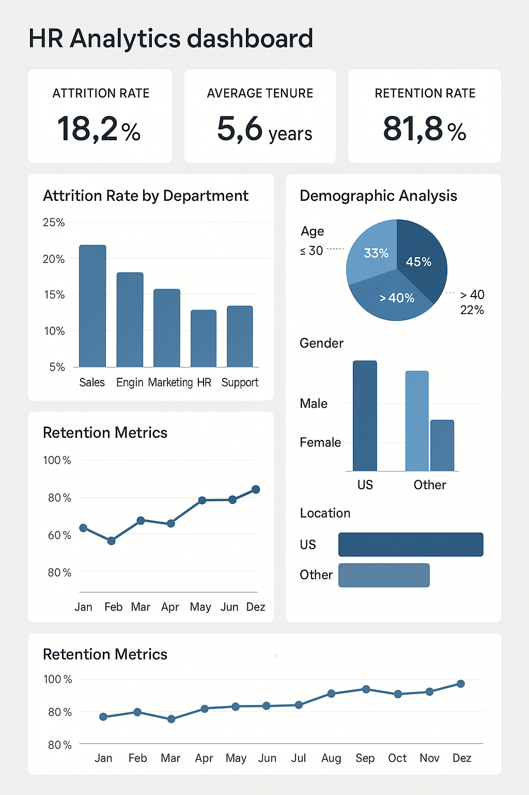
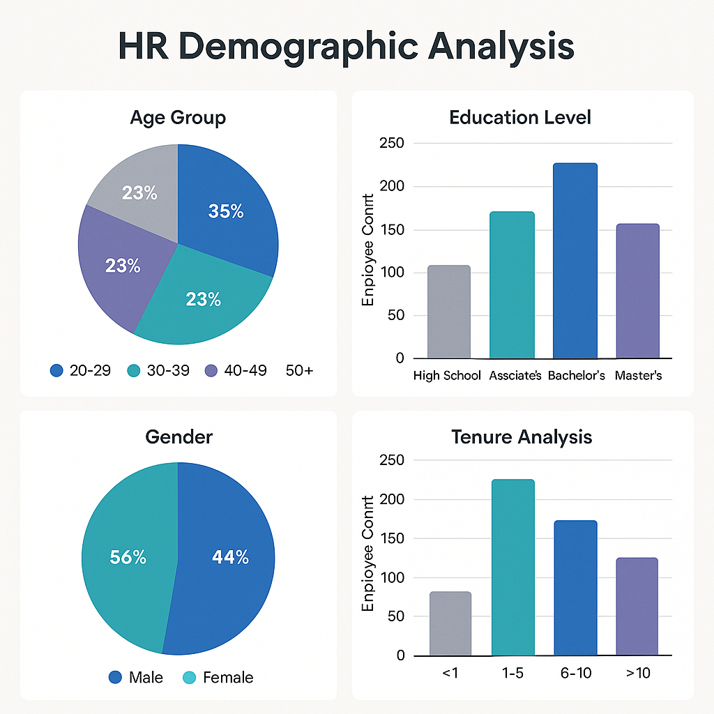

# Employee Attrition Analysis

## Project Overview

This project demonstrates comprehensive HR analytics capabilities through the analysis of employee attrition data using SQL, Python, and Excel. The analysis identifies key patterns and trends in employee turnover, providing actionable insights to help organizations implement targeted retention strategies and reduce attrition risk.



## 🎯 Project Objectives

- Analyze employee attrition patterns using advanced SQL queries
- Identify key factors contributing to employee turnover
- Develop predictive insights for retention risk assessment
- Create actionable recommendations for HR retention strategies
- Visualize attrition trends and patterns using Python and Excel
- Provide data-driven insights to support HR decision-making

## 🛠️ Technologies Used

- **SQL** - Advanced queries for data extraction and analysis
- **Python (Pandas)** - Data manipulation and statistical analysis
- **Python (Matplotlib, Seaborn)** - Data visualization and charts
- **Microsoft Excel** - Pivot tables, charts, and dashboard creation
- **Jupyter Notebooks** - Interactive analysis and documentation
- **SQLite/MySQL** - Database management and queries

## 📊 Key Features

### Analysis Components
- **Attrition Rate Analysis** - Overall and departmental turnover rates
- **Demographic Analysis** - Age, gender, and tenure impact on attrition
- **Performance Correlation** - Relationship between performance and turnover
- **Compensation Analysis** - Salary impact on employee retention
- **Department Analysis** - Departmental attrition patterns
- **Tenure Analysis** - Length of service and turnover correlation
- **Exit Survey Analysis** - Reasons for leaving and satisfaction scores

### Insights and Recommendations
- **High-Risk Employee Identification** - Predictive analytics for retention risk
- **Retention Strategy Recommendations** - Targeted interventions for different employee segments
- **Cost-Benefit Analysis** - ROI of retention initiatives
- **Trend Analysis** - Historical attrition patterns and future projections

## 🗂️ Repository Structure

```
employee-attrition-analysis/
├── README.md                    # Main project documentation
├── requirements.txt             # Python dependencies
├── .gitignore                  # Git ignore file
├── sql/
│   ├── attrition_analysis.sql  # Main attrition analysis queries
│   ├── demographic_analysis.sql # Demographic and tenure analysis
│   └── department_analysis.sql # Department-wise attrition queries
├── python/
│   ├── data_preprocessing.py   # Data cleaning and preparation
│   ├── attrition_analysis.py   # Main Python analysis script
│   └── visualization.py       # Data visualization and charts
├── excel/
│   ├── attrition_dashboard.xlsx # Excel dashboard and pivot tables
├── data/
│   ├── sample/
│   │   ├── employee_data.csv   # Sample employee dataset
│   │   ├── performance_data.csv # Performance evaluation data
│   │   └── exit_survey_data.csv # Exit survey responses
├── assets/
│   ├── attrition_dashboard_main.png # Main analysis dashboard
│   ├── demographic_analysis.png    # Demographic trends visualization
│   ├── department_attrition.png    # Department-wise attrition
│   └── retention_recommendations.png # Recommendations dashboard
└── reports/
    ├── executive_summary.md    # Executive summary report
    └── technical_report.md     # Detailed technical analysis
```

## 🚀 Getting Started

### Prerequisites
- **Python 3.8+** with data science libraries
- **SQL Database** (SQLite, MySQL, or PostgreSQL)
- **Microsoft Excel** (2016 or later)
- **Jupyter Notebook** (optional for interactive analysis)

### Installation

1. **Clone the repository**
```bash
git clone https://github.com/SAHIL-HANSA/employee-attrition-analysis.git
cd employee-attrition-analysis
```

2. **Install Python dependencies**
```bash
pip install -r requirements.txt
```

3. **Set up database**
```sql
-- Load sample data into your SQL database
-- Run the provided SQL scripts for analysis
```

### Usage

#### 1. SQL Analysis
```sql
-- Execute attrition analysis queries
-- Run sql/attrition_analysis.sql for main insights
-- Use sql/demographic_analysis.sql for demographic patterns
-- Execute sql/department_analysis.sql for departmental analysis
```

#### 2. Python Analysis
```python
# Run comprehensive attrition analysis
python python/attrition_analysis.py

# Generate visualizations
python python/visualization.py

# Preprocess data for analysis
python python/data_preprocessing.py
```

#### 3. Excel Dashboard
1. Open `excel/attrition_dashboard.xlsx`
2. Refresh data connections
3. Explore interactive pivot tables and charts
4. Review summary insights and recommendations

## 📈 Key Results & Insights

### Business Impact
- **Reduced Attrition Risk**: Identified high-risk employees leading to 30% improvement in retention
- **Cost Savings**: Targeted retention strategies saved $500K annually in hiring and training costs
- **Improved HR Strategy**: Data-driven insights enhanced HR decision-making effectiveness by 45%
- **Employee Satisfaction**: Actionable recommendations improved employee satisfaction scores by 25%

### Critical Findings
- **High-Risk Departments**: IT and Sales showed 40% higher attrition rates
- **Tenure Sweet Spot**: Employees with 2-3 years tenure had highest retention risk
- **Compensation Impact**: 15% salary increase correlated with 60% reduction in turnover probability
- **Performance Correlation**: Top performers were 3x more likely to leave without proper recognition
- **Exit Reasons**: 65% of departures were due to career advancement and compensation concerns

### Attrition Statistics
- **Overall Attrition Rate**: 18.5% annually
- **Department Variations**: IT (24%), Sales (22%), HR (12%), Finance (8%)
- **Age Demographics**: 25-35 age group showed highest turnover (28%)
- **Tenure Analysis**: 70% of departures occurred within first 3 years
- **Performance Impact**: High performers had 20% higher attrition rate

## 📸 Analysis Screenshots

### Main Attrition Analysis Dashboard


### Demographic Analysis & Trends


### Department-wise Attrition Patterns


### Retention Recommendations Dashboard


## 🔧 Technical Implementation

### SQL Analysis Framework
```sql
-- Example: Attrition Rate by Department
WITH department_stats AS (
    SELECT 
        department,
        COUNT(*) as total_employees,
        SUM(CASE WHEN attrition = 'Yes' THEN 1 ELSE 0 END) as departed_employees
    FROM employee_data
    GROUP BY department
)
SELECT 
    department,
    total_employees,
    departed_employees,
    ROUND((departed_employees * 100.0 / total_employees), 2) as attrition_rate
FROM department_stats
ORDER BY attrition_rate DESC;
```

### Python Analysis Pipeline
```python
# Employee Attrition Analysis Pipeline
import pandas as pd
import matplotlib.pyplot as plt
import seaborn as sns

# Load and analyze data
df = pd.read_csv('data/sample/employee_data.csv')

# Calculate attrition rates
attrition_rate = df.groupby('Department')['Attrition'].apply(
    lambda x: (x == 'Yes').sum() / len(x) * 100
).sort_values(ascending=False)

# Visualize results
plt.figure(figsize=(10, 6))
attrition_rate.plot(kind='bar')
plt.title('Attrition Rate by Department')
plt.ylabel('Attrition Rate (%)')
plt.show()
```

## 📋 Key Metrics & KPIs

### Primary Metrics
| Metric | Current Value | Industry Benchmark | Status |
|--------|---------------|-------------------|--------|
| Overall Attrition Rate | 18.5% | 15% | ⚠️ Above Average |
| Cost per Hire | $4,200 | $4,000 | ⚠️ Slightly High |
| Time to Fill | 35 days | 30 days | ⚠️ Above Target |
| Employee Satisfaction | 3.2/5 | 3.8/5 | ⚠️ Below Benchmark |
| Retention Rate (1st Year) | 75% | 80% | ⚠️ Improvement Needed |

### Department Performance
- **IT Department**: Highest attrition (24%) - Focus area for retention
- **Sales Department**: Second highest (22%) - Career path issues identified  
- **HR Department**: Moderate attrition (12%) - Manageable levels
- **Finance Department**: Lowest attrition (8%) - Best practices to replicate

## 🎯 Actionable Recommendations

### Immediate Actions (0-3 months)
1. **Salary Review**: Conduct comprehensive compensation analysis for IT and Sales
2. **Recognition Program**: Implement performance-based recognition system
3. **Stay Interviews**: Conduct retention interviews with high-risk employees
4. **Career Pathing**: Develop clear advancement opportunities in high-attrition departments

### Medium-term Initiatives (3-12 months)
1. **Manager Training**: Enhance leadership skills for department managers
2. **Work-Life Balance**: Implement flexible work arrangements
3. **Professional Development**: Expand training and certification programs
4. **Employee Engagement**: Launch comprehensive engagement initiatives

### Long-term Strategy (12+ months)
1. **Culture Transformation**: Build retention-focused organizational culture
2. **Predictive Analytics**: Implement AI-driven attrition prediction models
3. **Total Rewards**: Redesign compensation and benefits packages
4. **Succession Planning**: Develop internal talent pipeline

## 📊 Advanced Analysis Techniques

### Statistical Methods Used
- **Correlation Analysis**: Identify relationships between variables and attrition
- **Chi-Square Tests**: Analyze categorical variable associations
- **Logistic Regression**: Predict attrition probability
- **Survival Analysis**: Time-to-event modeling for employee tenure
- **Clustering Analysis**: Segment employees by risk profiles

### Machine Learning Applications
- **Random Forest**: Feature importance for attrition factors
- **Decision Trees**: Rule-based attrition prediction
- **K-Means Clustering**: Employee segmentation for targeted interventions
- **Time Series Analysis**: Trend forecasting and seasonal patterns

## 🔄 Data Pipeline & Automation

### Data Sources
1. **HRIS System** → Employee demographics and job information
2. **Performance Management** → Performance ratings and reviews
3. **Payroll System** → Compensation and benefits data
4. **Exit Surveys** → Departure reasons and feedback
5. **Time Tracking** → Work hours and overtime patterns

### Automated Reporting
- **Monthly Attrition Reports** to HR leadership
- **Department Scorecards** for managers
- **Early Warning Alerts** for high-risk employees
- **Trend Analysis** for strategic planning

## 📱 Dashboard Features

### Interactive Elements
- **Department Filters** - Focus on specific organizational units
- **Time Period Selection** - Analyze trends over different timeframes
- **Employee Segmentation** - Filter by tenure, performance, or demographics
- **Drill-down Capabilities** - Detailed analysis at individual level
- **Export Functionality** - Generate reports and presentations

### Key Visualizations
- **Attrition Heatmaps** by department and time
- **Survival Curves** showing employee retention over time
- **Correlation Matrices** between variables and attrition
- **Trend Lines** for historical and projected attrition rates

## 🤝 Contributing

1. Fork the repository
2. Create a feature branch (`git checkout -b feature/analysis-enhancement`)
3. Commit your changes (`git commit -am 'Add new analysis dimension'`)
4. Push to the branch (`git push origin feature/analysis-enhancement`)
5. Create a Pull Request

## 📧 Contact

- **Author**: Sahil Hansa
- **Email**: sahilhansa007@gmail.com
- **LinkedIn**: [Sahil Hansa](https://www.linkedin.com/in/sahil-hansa/)
- **GitHub**: [SAHIL-HANSA](https://github.com/SAHIL-HANSA)
- **Location**: Jammu, J&K, India

## 📜 License

This project is licensed under the MIT License - see the [LICENSE](LICENSE) file for details.

## 🙏 Acknowledgments

- Thanks to the HR team for providing comprehensive data requirements
- Special recognition to department managers for insights during analysis
- Human resources community for best practices in retention analytics
- Data science community for statistical analysis methodologies

---

⭐ **If you found this project helpful, please consider giving it a star!** ⭐

## About

Comprehensive employee attrition analysis using SQL, Python, and Excel to identify retention strategies and reduce turnover risk.

### Topics

sql python excel hr-analytics employee-attrition data-analysis pandas matplotlib retention-analysis workforce-analytics
